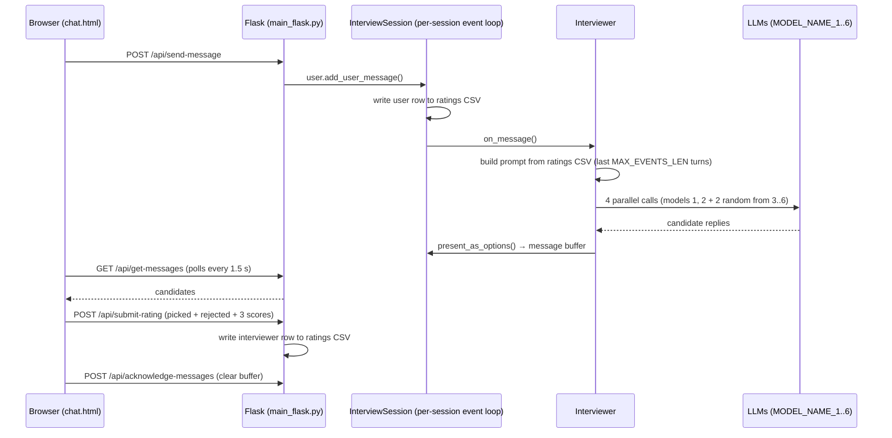

# SparkMe — Arabic Cultural Chat Annotation

A Flask web app for collecting human preference ratings of LLM responses on Arabic cultural topics.

Each participant (annotator) logs in, completes a demographic survey, and works through a list of pre-assigned chat sessions. A session is seeded from a [PALM](https://huggingface.co/datasets/UBC-NLP/palm) prompt for one **country** and **topic**. On every turn, up to **4 different LLMs** answer in parallel. The annotator picks the best answer, rates it on three 1–5 scales, and the picked answer becomes the conversation history for the next turn. Everything is written to one CSV per session.

> **Fork note.** This repo is forked from [SALT-NLP/SparkMe](https://github.com/SALT-NLP/SparkMe), a multi-agent interview system. Most of that machinery (session scribe, strategic planner, report team, memory/question banks) is still in the tree but **dormant**: it is constructed and never used. The upstream README is kept at [`docs/UPSTREAM_SPARKME.md`](docs/UPSTREAM_SPARKME.md).

See [`src/README.md`](src/README.md) for which code is live and which is not.

See [`docs/ANNOTATION_OPERATIONS.md`](docs/ANNOTATION_OPERATIONS.md) for usage guidelines for country representatives.

---

## Quick start

```bash
# Python 3.11+ (pandas 3 / numpy 2.4)
pip install -r requirements.txt   # pinned from the working study environment
cp .env_sample .env                  # then fill in the keys, MODEL_NAME_1..6, DATA_DIR, LOGS_DIR

python -m src.main_flask --port 5000 # run from the repo root (imports use the `src.` prefix)
```

Open `http://<host>:5000/login`. The health check is at `/health`.

**Run exactly one process.** Live sessions are held in memory (`active_sessions` in `main_flask.py`). With several gunicorn workers, a participant's requests land on workers that don't know their session. If you ever put it behind gunicorn, use `-w 1` with multiple threads.

---

## Running a study: the operator workflow

The step-by-step version, including server access and annotator screening, is in [`docs/ANNOTATION_OPERATIONS.md`](docs/ANNOTATION_OPERATIONS.md).

| # | Step | How |
|---|------|-----|
| 1 | **Generate session lists** for each annotator from PALM | `scripts/generate_user_sessions_file.py` (see [`scripts/README.md`](scripts/README.md)) |
| 2 | **Annotator registers** at `/register`: username, password, country | Writes `DATA_DIR/users.json` and creates their folders |
| 3 | **Assign sessions**: copy a generated batch file to `DATA_DIR/<country_slug>/<user_id>/user_sessions.json` | Manual. `user_id` is the key in `users.json`. For the next batch, rename the finished file (e.g. `user_sessions_batch0.json`) and copy the new batch in |
| 4 | **Annotator works**: survey, then session list, then chat | See the flow below |
| 5 | **Collect data** from `LOGS_DIR/<country_slug>/<user_id>/ratings/*.csv` | One CSV per assigned session |
| 6 | **Clean up** when needed | `scripts/delete_users.py` (dry run unless `--apply`), `scripts/dedup_ratings_csv.py` (**writes** unless `--dry-run`) |

### What the annotator sees

1. **`/login`** or **`/register`**.
2. **`/survey`**: demographic survey. Required once before anything else. Saved to `survey.json`.
3. **`/`**: session list, loaded from `user_sessions.json`. Each item shows the topic, turn count, and the suggested first prompt.
4. **`/chat`**: the annotation loop:
   - The annotator writes the first message (the suggested PALM prompt is only a hint).
   - Up to 4 candidate replies appear, shuffled and anonymised.
   - The annotator picks one and rates it on **MSA Fluency**, **Cultural Appropriateness**, and **Contextual Relevance** (1–5 each). They can cancel and pick another before submitting.
   - They reply again. After `n_turns` user messages, one final set of candidates is generated. Rating it completes the session.
   - Refreshing or reconnecting is safe. History is rebuilt from the CSV, and the interviewer is re-triggered if it still owes a reply.

---

## How one turn works



The **ratings CSV is the single source of truth**. The interviewer's prompt, the resume-after-refresh logic, and completion detection all read from it. Rejected candidates never enter the conversation history.

---

## Data layout

`DATA_DIR` and `LOGS_DIR` come from `.env`. In production they are `data/data` and `data/logs`.

```
DATA_DIR/
├── users.json                         # registry: user_id → {username, password (SHA-256), country, created_at}
└── <country_slug>/<user_id>/
    ├── user_sessions.json             # assigned sessions (you create this, step 3)
    └── survey.json                    # demographic survey answers

LOGS_DIR/<country_slug>/<user_id>/
├── ratings/<session_id>_<country>_<topic>_<n_turns>.csv   # ← the study data
├── execution_logs/session_1/*.log     # debug logs (see gotcha below)
└── statistics/session_1/*.json        # token usage
```

**Ratings CSV columns** (one row per turn, strictly alternating user and interviewer):

| Column | Meaning |
|---|---|
| `timestamp` | Row write time. For interviewer rows, this is when the rating was *submitted*, not when the reply was generated |
| `message_id` | ID of the picked candidate (`<uuid>\|<index>`), or a fresh UUID for user rows |
| `liked_response` | User text (user rows) or the picked candidate (interviewer rows) |
| `rating_cultural`, `rating_fluency`, `rating_contextual` | 1–5. Empty on user rows |
| `rejected_options` | Texts of the candidates not picked |
| `follow_up` | Always empty (feature removed) |
| `topic`, `country` | From the assignment |
| `liked_model` | `user` for user rows, otherwise the model that produced the picked reply |
| `rejected_options_models`, `rejected_option_message_ids` | Models and IDs of the rejected candidates |

The CSV is written with `quoting=QUOTE_ALL, escapechar='\\'`. Read it with the same `escapechar`, or backslashes come back doubled.

---

## Configuration (`.env`)

Only these matter for the web study. `.env_sample` lists everything.

| Variable | Purpose |
|---|---|
| `MODEL_NAME_1`, `MODEL_NAME_2` | Models shown on **every** turn |
| `MODEL_NAME_3` … `MODEL_NAME_6` | Rotating pool. 2 are picked at random each turn. The pool stops at the first unset slot |
| Model name prefixes | `openrouter:`, `fanar:`, `jais:`, `gemini-api:`, `vllm:`, `openai-next:`, or a plain OpenAI name. See `src/utils/llm/engines.py` |
| `OPENROUTER_API_KEY`, `FANAR_API_KEY`, `GEMINI_API_KEY`, … | Credentials for the providers you use |
| `MODEL_NAME` (+ that provider's key, e.g. `OPENAI_API_KEY`) | Still needed. Dormant agents build a default engine from it at startup, even though it is never called |
| `EMBEDDING_BACKEND` | `openai` by default. Nothing in the web flow reads embeddings, so `noop` avoids needing an OpenAI key for them |
| `FLASK_SECRET_KEY` | **Set this.** Without it a random key is generated on each start, which logs everyone out on restart |
| `DATA_DIR`, `LOGS_DIR` | Storage roots (see above) |
| `ENGINE_TIMEOUT_SECONDS` (20), `ENGINE_MAX_ATTEMPTS` (3), `INTERVIEWER_MAX_TOKENS` (3000), `ENGINE_MAX_WORKERS` (16) | Per-call timeout, retries, output cap, and LLM thread-pool size |
| `MAX_EVENTS_LEN` | How many past turns go into the prompt |
| `SESSION_TIMEOUT_MINUTES` | Inactivity after which a live session stops (its loop exits). The annotator can reopen it, and it resumes from the CSV |

---

## Known issues and gotchas

These are open on `main` as of this writing, ordered roughly by impact.

- **Committed credentials**: `src/utils/llm/models/openai_next.py` and `jais.py` contain API keys in source. Rotate them and move them to `.env`.
- **Passwords use unsalted SHA-256** (`hash_password` in `main_flask.py`).
- **Process-wide state**: `SessionLogger._current_logger` and `BaseAgent.token_tracker` / `current_turn` are class variables. They point to whichever session was created last, so with concurrent participants, *execution logs and token statistics* can be filed under the wrong user. Ratings CSVs are **not** affected: they use explicit `user_id` and `country`.
- **Internal `session_id` is always 1** in web mode, because the session agenda is never saved. All of a user's sessions share `execution_logs/session_1/` and `statistics/session_1/`. The real per-assignment key is `sel_session_id`, the `session_id` in `user_sessions.json`.
- **Rating columns were transposed before commit `c4d110d` (2026-08-16).** Older CSVs have cultural and fluency swapped. They need a one-off migration before analysis.
- **Saudi Arabia naming mismatch**: registration stores `KSA`, but PALM session files use `Saudi Arabia`. A Saudi annotator's files are split between `…/ksa/<user_id>/` (survey, sessions, logs) and `…/saudi_arabia/<user_id>/ratings/`. `Libya` can be registered but has no sessions in the generator.
- **Committed account**: `data/data/users.json` in the repo holds one account entry. With `DATA_DIR=data/data`, that entry is a working login. Remove it before a fresh deployment.
- **World-writable files**: the code runs `chmod 777` on user folders and CSVs.
- **Memory**: each live session owns a thread and an event loop. They are evicted by `cleanup_old_sessions()` every 5 minutes (idle > 30 min, or finished > 10 min).

---

## Repository map

| Path | Status | What it is |
|---|---|---|
| `src/main_flask.py` | **Live** | Web app: auth, survey, session list, chat API, cleanup |
| `src/interview_session/` | **Live** | Per-session state, turn counting, farewell, CSV writes |
| `src/agents/interviewer/interviewer.py` | **Live** | Generates the 4 candidates per turn |
| `src/utils/` (`data_process`, `user_paths`, `llm/`, `logger/`, `token_tracker`) | **Live** | CSV I/O, paths, LLM engines, logging |
| `src/web/` | **Live** | Templates + CSS (`index`, `text_chat`, `speech_chat` templates are unused) |
| `scripts/` | **Live** (mostly) | Operator scripts. See [`scripts/README.md`](scripts/README.md) |
| `src/agents/{session_scribe,strategic_planner,report_team,user}`, `src/content/` | Dormant | Upstream SparkMe agents. Constructed or imported, but never run |
| `src/main.py` | Deprecated | Upstream terminal mode. Untested with the current interviewer |
| `baselines/`, `evaluation/`, `dataset_gen/`, `scripts/annotations/`, `scripts/web_interview/` | Upstream only | SparkMe paper code and deploy scripts. Not used by this study |
| `data/data/` | Mixed | `topics.csv` and `regions.csv` are read at every session start (resolved relative to the repo, not `DATA_DIR`). `follow-ups*.csv` is unused. `users.json` is a committed sample |
| `data/configs/`, `data/sample_user_profiles/`, `data/workbank_seed/` | Upstream only | WorkBank interview configs and personas |

Full per-file detail is in [`src/README.md`](src/README.md).
